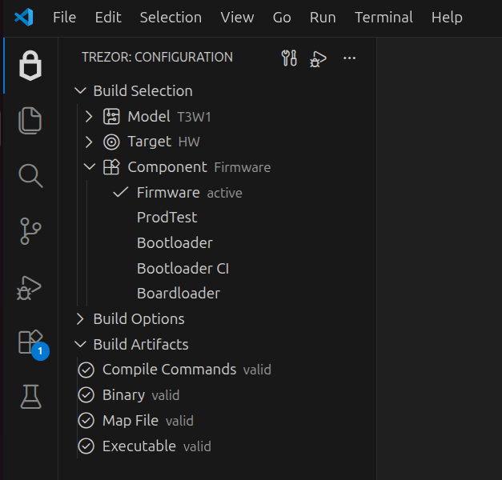

# Trezor Firmware Tools

Trezor Firmware Tools helps you work with `trezor-firmware` more comfortably inside VS Code by adding a dedicated Configuration view where you can choose the active build context, adjust build options, run common firmware tasks, and work with the build artifacts used by IntelliSense and debugging.

The extension is intended for use with the new cargo-based build system. It does not support the legacy SCons-based firmware build scripts used in older repository layouts.



## How to Install

The extension is not published in the VS Code Marketplace yet, so it must be installed manually as a `.vsix` package.

Download the latest `.vsix` package from the [release page](https://github.com/cepetr/vscode-tf-tools/releases). Then, in VS Code, open the Command Palette, run `Extensions: Install from VSIX...`, and select the extension package file.

**Enable this extension only in the `trezor-firmware` repository, and disable it in other workspaces.**

## How to Set Up and Configure

Before starting VS Code, enter the `trezor-firmware` development shell from the repository root and launch VS Code from that shell so it inherits the environment:

- run `nix-shell` for the standard development environment
- run `nix-shell --arg devTools true` if you also want tools such as `openocd` for ST-Link debugging

The extension does not require these VS Code settings, but they are recommended for a smoother experience with the new build system. The repository does not include a shared `.vscode/settings.json`, so it is worth creating one locally and adapting it to your environment. The following example is a good starting point:

```json
{
    "git.detectSubmodulesLimit": 20,
    "git.detectSubmodules": true,
    "python.useEnvironmentsExtension": false,
    "python.defaultInterpreterPath": "${workspaceFolder}/.venv/bin/python",
    "python.terminal.activateEnvironment": true,
    "terminal.integrated.env.linux": {
        "VIRTUAL_ENV": "${workspaceFolder}/.venv",
        "PATH": "${workspaceFolder}/.venv/bin:${env:PATH}"
    },
    "rust-analyzer.linkedProjects": [
        "${workspaceFolder}/core/embed/Cargo.toml",
    ],
    "rust-analyzer.cargo.targetDir": true,
    "rust-analyzer.cargo.features": "all",
    "rust-analyzer.cargo.extraEnv": {
        "IS_RUST_ANALYZER": "true"
    },
    "cortex-debug.variableUseNaturalFormat": false,
    "C_Cpp.default.configurationProvider": "cepetr.tf-tools"
}
```

NOTE: `IS_RUST_ANALYZER` is not required by the extension. It is recommended because it minimizes the work done by `build.rs` scripts so Rust Analyzer can run quickly and avoid failures when all features are enabled, without compiling the C code.

## What It Does

- Lets you choose the active `model`, `target`, and `component` in one place.
- Remembers build options for the active configuration.
- Gives you quick access to common workflows such as `Build`, `Clippy`, `Check`, and `Clean`.
- Exposes device actions such as `Flash to Device` and `Upload to Device` when they are available.
- Starts a debug session for the active configuration when debugging is supported.
- Shows build artifacts such as compile commands, binary, map file, and executable.
- Refreshes C/C++ IntelliSense from the active compile database.
- Marks files that are outside the active build configuration.

## How To Use

Open the `Trezor` activity-bar view and use the `Configuration` tree:

- Choose the active build context in `Build Selection`.
- Enable or adjust build options in `Build Options`.
- Start with `Build` to produce the artifacts for the active configuration.
- Check `Build Artifacts` to confirm that the expected outputs were created.
- After a successful build, use `Flash to Device` or `Upload to Device` to send the firmware to hardware when needed.
- Use `Start Debugging` when the active configuration provides a valid executable and debug support.

The extension can also show the current build context in the status bar and makes key actions available from the Command Palette.

## Workspace Requirements

The extension is designed for the `trezor-firmware` repository opened as a single-root VS Code workspace.

It expects:

- the `xtask` build tool to be present in the repository
- a tf-tools manifest file
- a cargo workspace
- a build artifacts directory
- optional debug templates for debug launch support

In the default `trezor-firmware` layout, the extension finds these automatically and usually does not need additional configuration.

The extension relies on repository-specific manifest data, paths, and generated artifacts that are already present in the workspace. For more information, see the [product specification](specs/product-spec.md).

## Configuration

These workspace settings can be used when you need to override the automatically detected paths:

- `tfTools.manifestPath`
- `tfTools.cargoWorkspacePath`
- `tfTools.artifactsPath`
- `tfTools.debug.templatesPath`

You can adjust optional UI behavior with:

- `tfTools.showConfigurationInStatusBar`
- `tfTools.excludedFiles.grayInTree`
- `tfTools.excludedFiles.showEditorOverlay`
- `tfTools.excludedFiles.fileNamePatterns`
- `tfTools.excludedFiles.folderGlobs`

