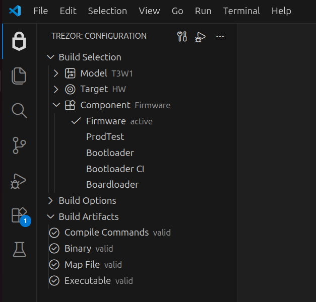

# Trezor Bench

Trezor Bench is a VS Code extension for building and debugging [Trezor firmware](https://github.com/trezor/trezor-firmware). It is intended for developers working in the `trezor-firmware` repository and brings its cargo-based build workflow into VS Code.

Choose the active build context — model, target, component, preset — in a dedicated view, and the rest follows it:

- **xtask integration** — build options and workflows in the UI instead of on the command line
  - run `build`, `clippy`, `check`, and `clean` as VS Code tasks
  - flash or upload the resulting artifacts to a device
- **IntelliSense** — C/C++ IntelliSense (cpptools or clangd) driven by the compile database of the active context
- **Debugging** — start a debug session for the active context without writing a `launch.json`

The extension is intended for use with the new cargo-based build system. It does not support the legacy SCons-based firmware build scripts used in older repository layouts.



## How to Install

Install [Trezor Bench from the Visual Studio Marketplace](https://marketplace.visualstudio.com/items?itemName=cepetr.tbench) to receive automatic updates.

Alternatively, download the latest `.vsix` package from the [release page](https://github.com/cepetr/trezor-bench/releases). Then, in VS Code, open the Command Palette, run `Extensions: Install from VSIX...`, and select the extension package file.

**Enable this extension only in the `trezor-firmware` repository, and disable it in other workspaces.**

## How to Set Up and Configure

Before starting VS Code, enter the `trezor-firmware` development shell from the repository root and launch VS Code from that shell so it inherits the environment:

- run `nix-shell` for the standard development environment
- run `nix-shell --arg devTools true` if you also want tools such as `openocd` for ST-Link debugging

The extension does not require these VS Code settings, but they are recommended for a smoother experience with the new build system. The repository does not include a shared `.vscode/settings.json`, so it is worth creating one locally and adapting it to your environment. The following example is a good starting point:

```json
{
    "git.detectSubmodulesLimit": 20,
    "git.detectSubmodules": true,
    "python.useEnvironmentsExtension": false,
    "python.defaultInterpreterPath": "${workspaceFolder}/.venv/bin/python",
    "python.terminal.activateEnvironment": true,
    "terminal.integrated.env.linux": {
        "VIRTUAL_ENV": "${workspaceFolder}/.venv",
        "PATH": "${workspaceFolder}/.venv/bin:${env:PATH}",
    },
    "terminal.integrated.env.osx": {
        "VIRTUAL_ENV": "${workspaceFolder}/.venv",
        "PATH": "${workspaceFolder}/.venv/bin:${env:PATH}",
    },
    "rust-analyzer.linkedProjects": [
        "${workspaceFolder}/core/embed/Cargo.toml",
    ],
    "rust-analyzer.cargo.targetDir": true,
    "rust-analyzer.checkOnSave": true,
    "rust-analyzer.cargo.features": "all",
    "rust-analyzer.cargo.extraEnv": {
        "IS_RUST_ANALYZER": "true",
        "VIRTUAL_ENV": "${workspaceFolder}/.venv",
        "PYTHONPATH": "${workspaceFolder}/.venv/lib/python3.13/site-packages",
        "SCM_REVISION": "0000000000000000000000000000000000000000",
    },
    "C_Cpp.default.configurationProvider": "cepetr.tbench",
    
    // The rest is not required, it is just an optimization

    "rust-analyzer.cachePriming.enable": false,
    "rust-analyzer.lru.capacity": 64,
    "editor.inlayHints.enabled": "off",
    "npm.autoDetect": "off",
    "js/ts.tsc.autoDetect": "off",
    "files.watcherExclude": {
        "core/build-xtask/**": true,
        "core/build/**": true,
        "tests/ui_tests/reporting/master_cache/**": true,
        "tests/ui_tests/screens/**": true,        
        "**/.git/**": true,
    },
}
```

NOTE: `IS_RUST_ANALYZER` is not required by the extension. It is recommended because it minimizes the work done by `build.rs` scripts so Rust Analyzer can run quickly and avoid failures when all features are enabled, without compiling the C code.

## How To Use

Open the `Trezor Bench` activity-bar container and use the `Configuration` view:

- Choose the active build context in `Build Selection`.
- Adjust build options in `Build Options` if needed.
- Start with `Build` to produce the artifacts for the active configuration.
- Check `Build Artifacts` to confirm that the expected outputs were created.
- After a successful build, use `Flash to Device` or `Upload to Device` to send the firmware to hardware when needed.
- Use `Start Debugging` when the active configuration provides a valid executable and debug support.

The extension can also show the current build context in the status bar and makes key actions available from the Command Palette. It ships no keyboard shortcuts of its own, so you can bind the `Trezor Bench: ...` commands to whatever keys you prefer in `Keyboard Shortcuts`.

## Workspace Requirements

The extension is designed for the `trezor-firmware` repository opened as a single-root VS Code workspace.

The extension relies on repository-specific manifest data, paths, and generated artifacts that are already present in the workspace. For more information, see the [product specification](specs/product-spec.md).

## Development

This extension was developed entirely with AI assistance — GitHub Copilot and Claude — following a spec-driven workflow based on [spec-kit](https://github.com/github/spec-kit). Every feature starts as a specification and plan under [specs/](specs/), which is then turned into tasks and implemented.


